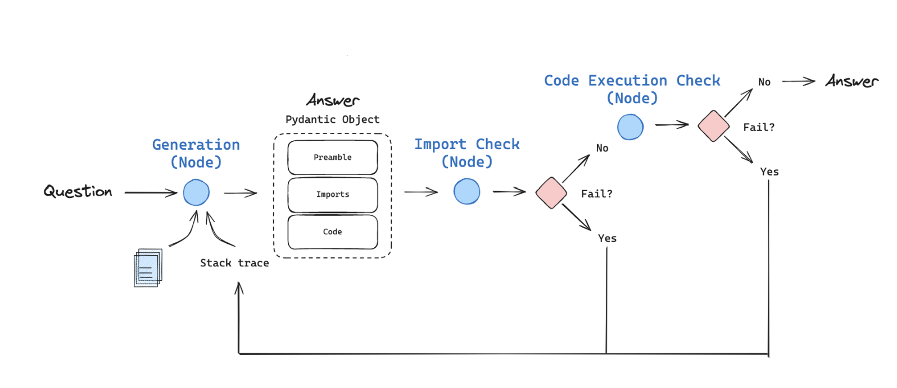

# Treesequence_LLM_Viz
Query based Code Generation and Analysis of Tree-Sequence using LLM.

### Goal
The goal is to leverage Large-language Models(LLM) to generate code and analyze tree-sequences using tskit by simply asking questions in plain English. With Retrieval-Augmented Generation (RAG), users can input questions in plain English, and the system will generate executable tskit code to answer these queries. 

### Current Version:
In this initial proof-of-concept, the tskit source code is used as a knowledge base for the Large Language Model (LLM). When users input queries in natural language, the LLM generates the appropriate code based on the knowledge and returns a python function as a response. 

Current version is a naive ```prompt:answer``` approach which does not evaluate the accuracy of the generated code. 

### Next things to do.
- [ ] Code generation can be improved using [Flow Engineering Approach](https://arxiv.org/pdf/2401.08500). Use LangGraph and openai Function Calling to setup the workflow. 
  
- [ ] Code execution with error checking.
- [ ] Multiple Iterations. 

### Exploration
-  How to enhance treesequence analysis. one way is [MemoRAG](https://github.com/qhjqhj00/MemoRAG). Memory-based knowledge discovery for long contexts. 


### How to Run. 
To install required dependencies
```
conda create -n treesequences python=3.10
conda activate treesequences
pip install -r requirments.txt
```
To test the program, run the following command:
```
python tree_llm.py
```

